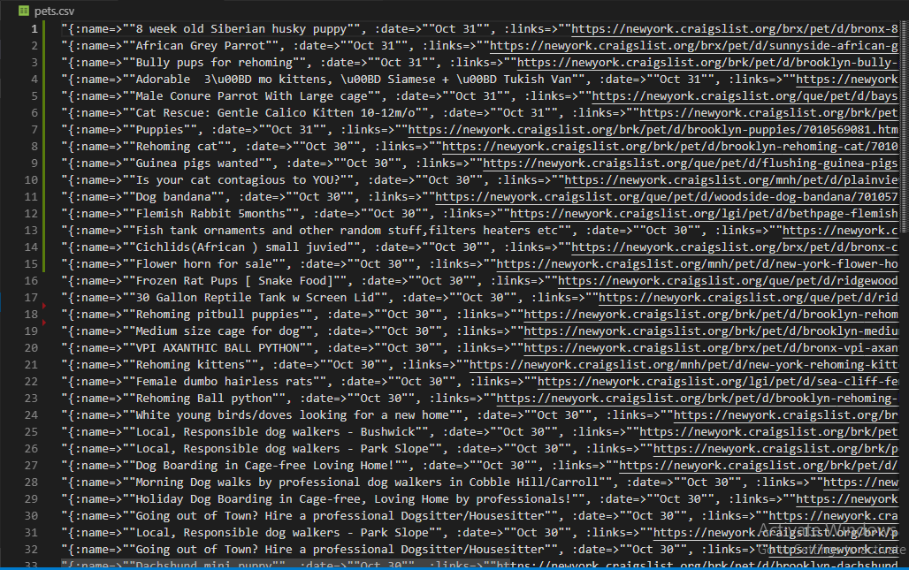

<!--
*** Thanks for checking out this README Template. If you have a suggestion that would
*** make this better, please fork the repo and create a pull request or simply open
*** an issue with the tag "enhancement".
*** Thanks again! Now go create something AMAZING! :D
-->


<!-- PROJECT SHIELDS -->
<!--
*** I'm using markdown "reference style" links for readability.
*** Reference links are enclosed in brackets [ ] instead of parentheses ( ).
*** See the bottom of this document for the declaration of the reference variables
*** for contributors-url, forks-url, etc. This is an optional, concise syntax you may use.
*** https://www.markdownguide.org/basic-syntax/#reference-style-links
-->
[![Contributors][contributors-shield]][contributors-url]
[![Forks][forks-shield]][forks-url]
[![Stargazers][stars-shield]][stars-url]
[![Issues][issues-shield]][issues-url]
[![MIT License][license-shield]][license-url]


<!-- PROJECT LOGO -->
<br />
<p align="center">
  <h3 align="center">Scrappy</h3>

  <p align="center">
    A Basic web scrapping app in Ruby
    <br />
    <a href="https://github.com/collinsugwu/scrappy/blob/master/README.md"><strong>Explore the docs �</strong></a>
    <br />
    <br />
    �
    <a href="https://github.com/collinsugwu/scrappy/issues">Report Bug</a>
    �
    <a href="https://github.com/collinsugwu/scrappy/issues">Request Feature</a>
  </p>
</p>


<!-- TABLE OF CONTENTS -->
## Table of Contents

* [About the Project](#about-the-project)
  * [Built With](#built-with)
* [Getting Started](#getting-started)
  * [Prerequisites](#prerequisites)
  * [Installation](#installation)
* [Usage](#usage)
* [Roadmap](#roadmap)
* [Contributing](#contributing)
* [License](#license)
* [Contact](#contact)
* [Acknowledgements](#acknowledgements)


<!-- ABOUT THE PROJECT -->
## About The Project

<p align="center">
    
</p>
<!-- [![Product Name Screen Shot][product-screenshot]](https://example.com) -->

Web Scraping (also termed Screen Scraping, Web Data Extraction, Web Harvesting etc.) is a technique employed to extract large amounts of data from websites whereby the data is extracted and saved to a local file in your computer or to a database in table (spreadsheet) format.

Web Scraping is the technique of automating this process, so that instead of manually copying the data from websites, the Web Scraping software will perform the same task within a fraction of the time.

### Built With
This progam was made using this technologies
* [Ruby](https://www.ruby-lang.org/en/)
* [Rubocop](https://github.com/rubocop-hq/rubocop)
* [Stickler](https://stickler-ci.com/)
* [Nokogiri](https://nokogiri.org/)
* [Pry]()
* [HTTParty](https://www.rubydoc.info/github/jnunemaker/httparty/HTTParty)


<!-- GETTING STARTED -->
## Getting Started

To get a local copy up and running follow these simple example steps.

### Prerequisites

* Ruby
You can easily install Ruby on your Linux computer by using [Homebrew](https://docs.brew.sh/) and [Chruby](https://github.com/postmodern/chruby)
```sh
brew install chruby
brew install ruby-install
ruby-install ruby
```

### Installation

<!-- 1. Get a free API Key at [https://example.com](https://example.com) -->
1. Clone the repo
```sh
git clone https://github.com/collinsugwu/scrappy.git
```
 2. Install Nokogiri gem
```sh
gem install nokogiri
``` 
 3. Install Pry gem
```sh
gem install pry
``` 
4. Install HTTParty gem
```sh
gem install httparty
```


<!-- USAGE EXAMPLES -->
## Usage

Scrappy scraps the [Newyork craigslist pets page](https://newyork.craigslist.org/search/pet?s=0&lang=en&cc=gb) using the HTTParty and parses the page with Nokogiri to be more readable. Different section of the web page is extracted using the css method in Nokogiri.

Each of the extracted data is stored in a csv file. 


<!-- ROADMAP -->
## Roadmap

See the [open issues](https://github.com/collinsugwu/scrappy/issues) for a list of proposed features (and known issues).


<!-- CONTRIBUTING -->
## Contributing

Contributions are what make the open source community such an amazing place to be learn, inspire, and create. Any contributions you make are **greatly appreciated**.

1. Fork the Project
2. Create your Feature Branch (`git checkout -b feature/AmazingFeature`)
3. Commit your Changes (`git commit -m 'Add some AmazingFeature'`)
4. Push to the Branch (`git push origin feature/AmazingFeature`)
5. Open a Pull Request


<!-- LICENSE -->
## License

Distributed under the MIT License. See `LICENSE` for more information.


<!-- CONTACT -->
## Contact


* Collins Ugwu: [Github](https://github.com/collinsugwu), [Twitter](https://twitter.com/collinsugwu_me
)


Project Link: [https://github.com/collinsugwu/scrappy](https://github.com/collinsugwu/scrappy)

<!-- ACKNOWLEDGEMENTS -->
## Acknowledgements
* [Craigslist](https://newyork.craigslist.org/)


<!-- MARKDOWN LINKS & IMAGES -->
<!-- https://www.markdownguide.org/basic-syntax/#reference-style-links -->
[contributors-shield]: https://img.shields.io/github/contributors/collinsugwu/scrappy
[contributors-url]: https://github.com/collinsugwu/scrappy/graphs/contributors
[forks-shield]: https://img.shields.io/github/forks/collinsugwu/scrappy
[forks-url]: https://github.com/collinsugwu/scrappy/network/members
[stars-shield]: https://img.shields.io/github/stars/collinsugwu/scrappy
[stars-url]: https://github.com/collinsugwu/scrappy/stargazers
[issues-shield]: https://img.shields.io/github/issues/collinsugwu/scrappy
[issues-url]: https://github.com/collinsugwu/Microverse-203-tic-tac-toe/issues
[license-shield]: https://img.shields.io/github/license/collinsugwu/scrappy
[license-url]: https://github.com/collinsugwu/scrappy/blob/master/LICENSE.txt
